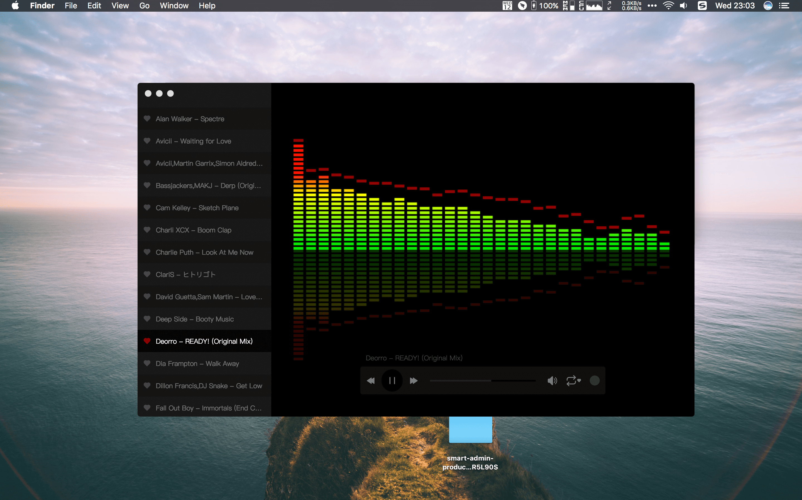

# boom

> A music player base on electron-vue

#### Build Setup

``` bash
# install dependencies
npm install

# serve with hot reload at localhost:9080
npm run dev

# build electron application for production
npm run build

# lint all JS/Vue component files in `src/`
npm run lint
```

#### Release

```bash
# install packager
npm install electron-packager -g

# pack
npm run pack && electron-packager . --overwrite

# move to Applications and enjoy it
mv ./boom-darwin-x64/boom.app /Applications
```

#### Configure

Default music directory is `~/Music`, click `boom => Preferences` and change it.


#### Preview



---

This project was generated with [electron-vue](https://github.com/SimulatedGREG/electron-vue)@[9c9bf75](https://github.com/SimulatedGREG/electron-vue/tree/9c9bf75630add075bfa58f52e391e82fb1b9f44a) using [vue-cli](https://github.com/vuejs/vue-cli). Documentation about the original structure can be found [here](https://simulatedgreg.gitbooks.io/electron-vue/content/index.html).
